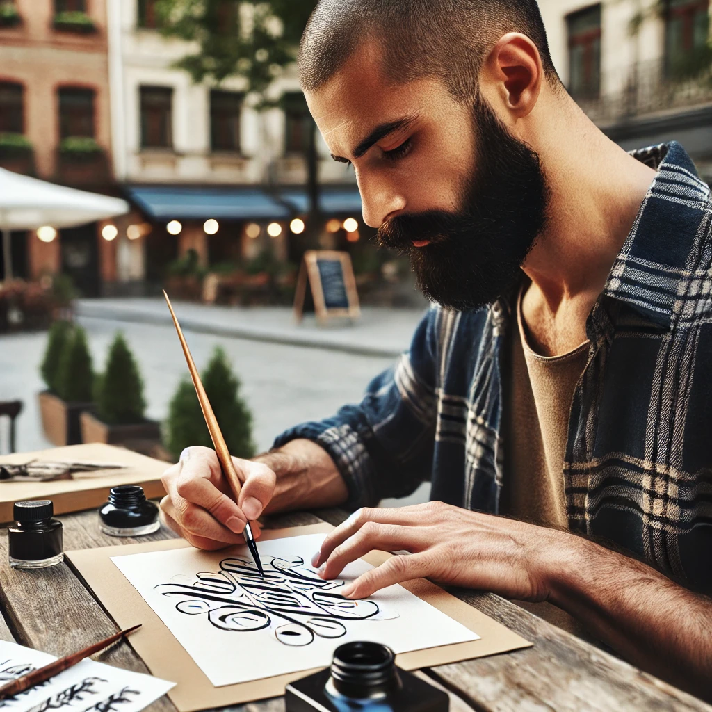
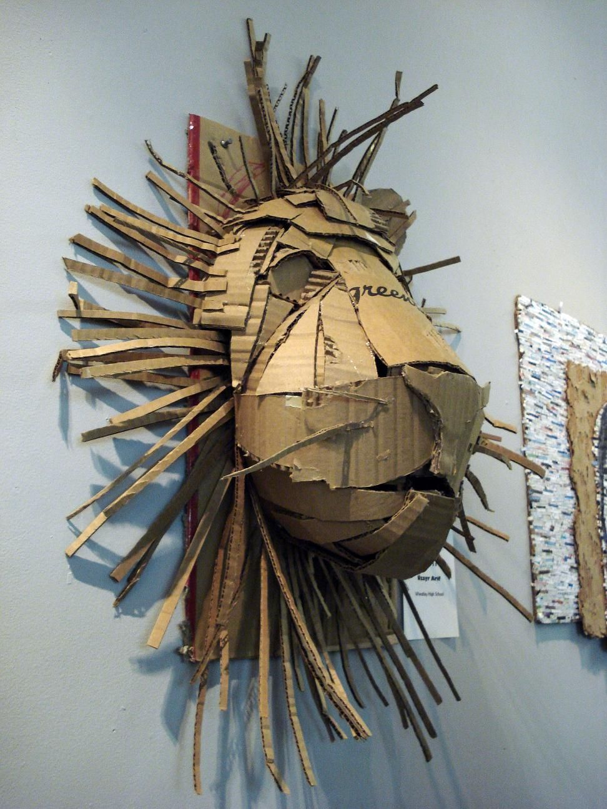
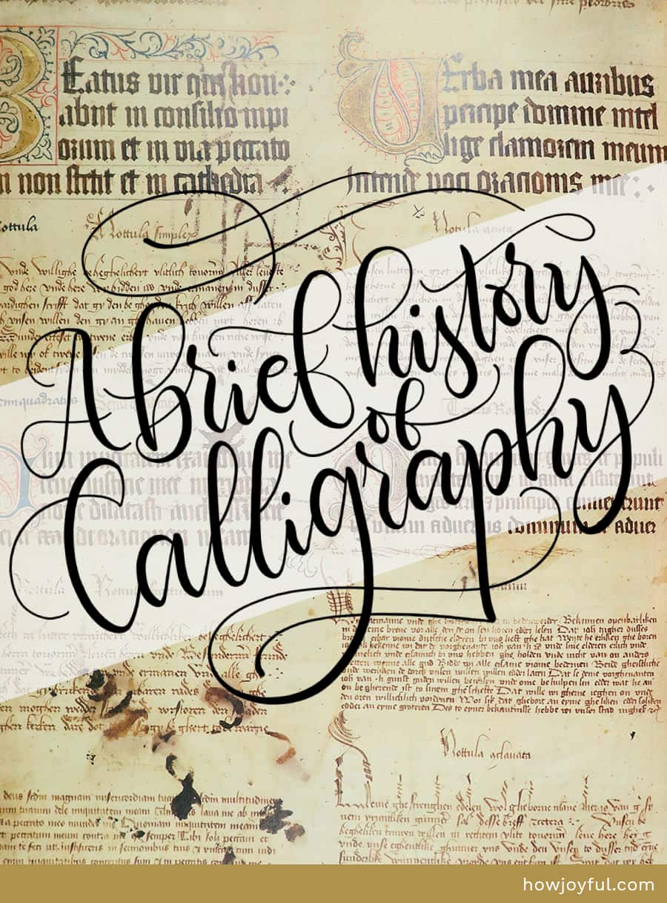
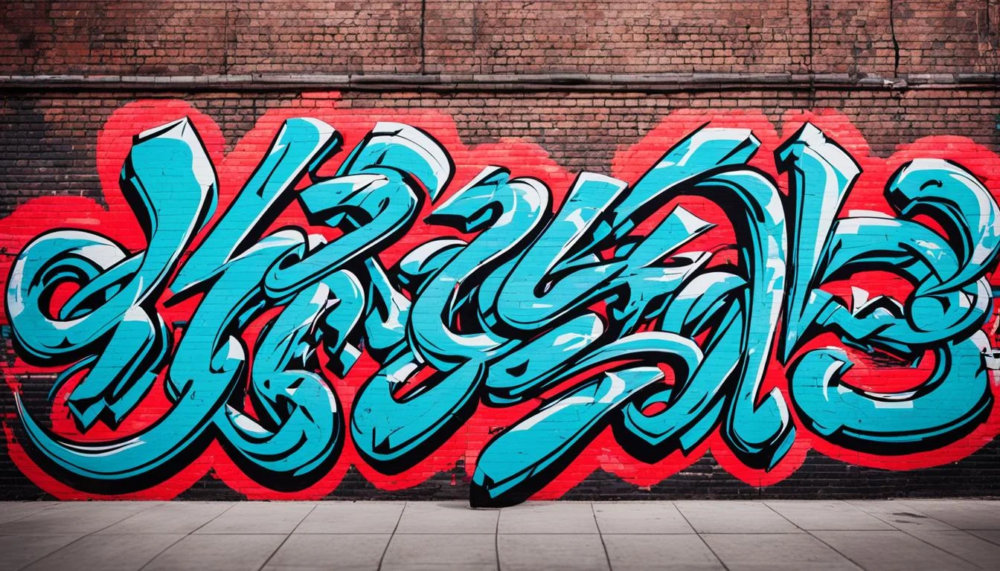
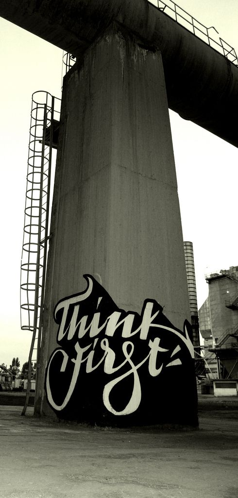
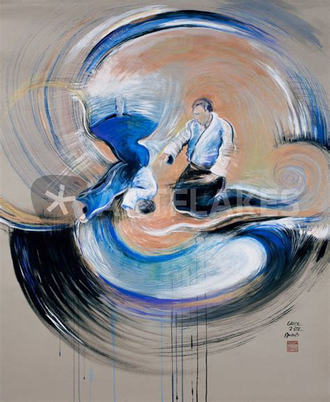
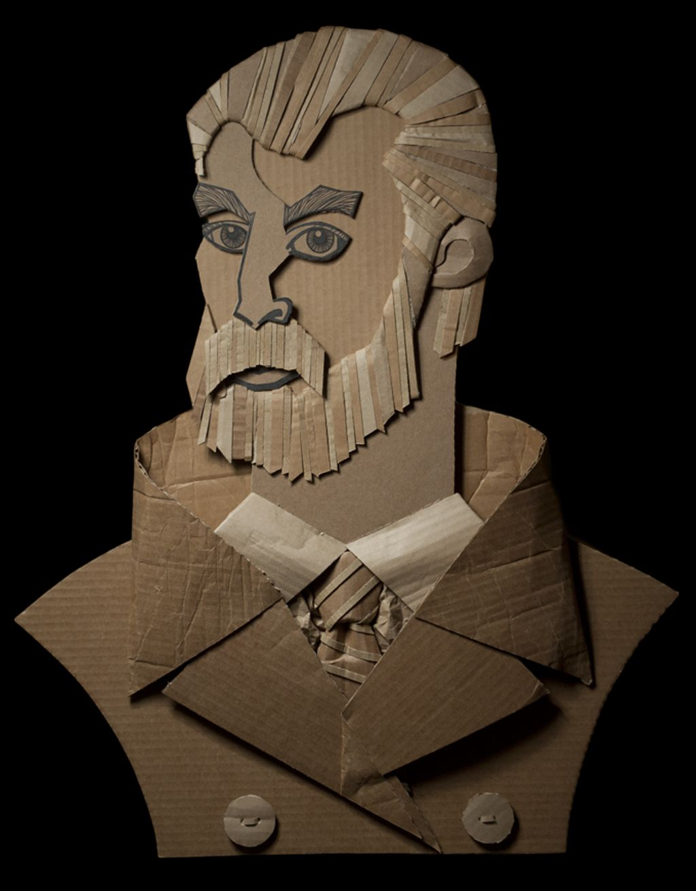

Hello, I’m Robert, a dedicated calligraphy artist living and creating in Austin, TX. My journey into this art form has been anything but typical, shaped by personal challenges, a deep love for history and the written word, and a commitment to sustainability. While I’m currently experiencing homelessness, I refuse to let my circumstances limit my creativity or my drive to share beauty with the world. In fact, these challenges have inspired me to embrace unconventional materials—most notably, recycled cardboard—transforming what many view as disposable into canvases for elegant, flowing script.

## Rooted in Authenticity

I create my work on reclaimed cardboard, turning this humble medium into a canvas for expression. This choice reflects my commitment to sustainability and resourcefulness, embodying the raw, unpolished beauty in everyday materials.

## A Storyteller at Heart

With a background in history and data analysis, I bring a deep appreciation for storytelling into my art. Every piece carries meaning—whether it’s about empowerment, gratitude, or hope—making my work more than just decorative. It’s a way to communicate profound truths and connect with others.

## A Fusion of Worlds

My style blends the elegance of traditional calligraphy with the dynamic energy of street art. This fusion creates work that is sophisticated yet approachable, structured yet free. It reflects both discipline and creativity, bridging the gap between timeless techniques and modern aesthetics.

## Empowerment Through Art

Through uplifting messages and intentional designs, I aim to inspire strength and authenticity in others. My work often focuses on themes of inner strength, gratitude, and personal growth, leaving a positive impact on all who encounter it.

## A Diverse Background

My diverse experiences have informed the way I think about art and communication. I hold a bachelor’s degree in history from the University of Southern Mississippi, earned in 2009. Studying narratives, cultures, and literature across time and place taught me to see language as art, not merely information. This perspective guides my pen and brush strokes, blending the aesthetics of written language with the depth of its meaning.

Over the years, I’ve explored various paths, each contributing to my artistic practice. As a first-degree black belt in Aikido, the principles of balance, harmony, and focus I’ve learned through martial arts naturally inform the measured grace of my calligraphy. Speaking German as a second language broadened my understanding of how words shape thought, culture, and identity. More recently, I’ve dedicated three years to training as a data analyst, honing my attention to detail, pattern recognition, and precision—qualities that shine through in the meticulous spacing and delicate forms of my letterwork.

## Connection to Aikido

As a practitioner of Aikido, I bring harmony and flow into my creative process. The discipline and balance inherent in martial arts influence the rhythm and energy of my strokes, creating pieces that feel both deliberate and natural.

## Urban Renaissance

I view my art as part of a modern urban renaissance—elevating overlooked materials and turning them into something beautiful and meaningful. This theme of transformation reflects not only my work but also my own journey. My artistic identity is a fusion of timeless artistry and contemporary grit, celebrating resilience and creativity. Each piece I create is an expression of my belief that art can transform not only materials but also perceptions, demonstrating that beauty and meaning can arise from even the most unlikely circumstances.

