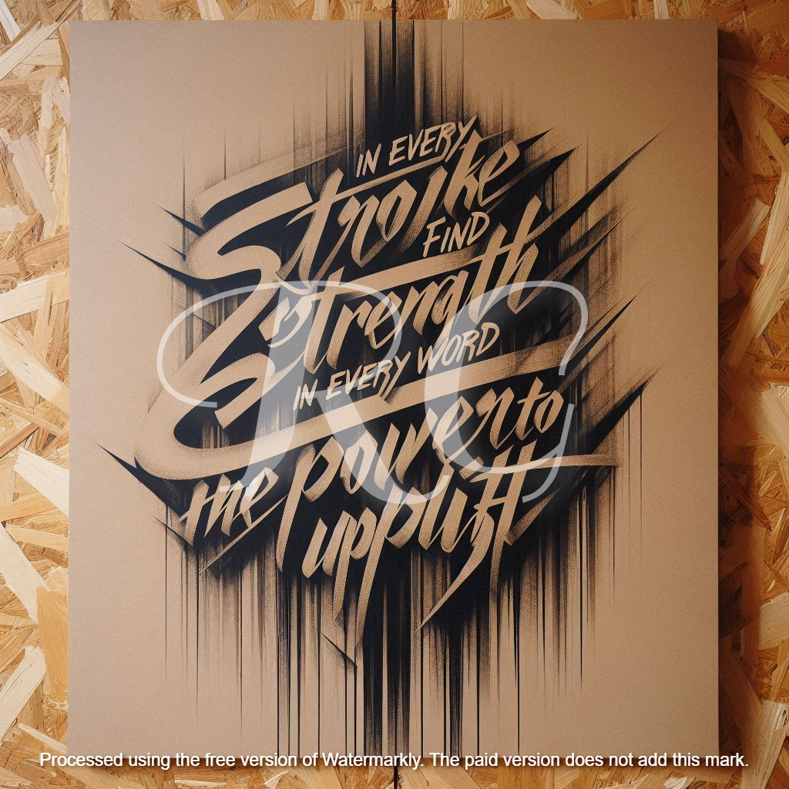

## Calligraphy: A Fusion of Tradition and Personal Expression

Calligraphy, often described as "the art of beautiful handwriting," transcends its functional roots to become a celebration of form, movement, and artistry. Over time, I have developed a unique style that blends classical techniques with modern, street-inspired aesthetics. My work embodies a dialogue between tradition and innovation, utilizing unconventional tools and materials to craft expressive visual stories.

---

### Materials and Process

My artistic process revolves around repurposing everyday materials into canvases for creativity. **Cardboard**, a raw and textured medium, serves as my primary canvas, lending each piece a tactile, authentic quality. This choice reflects both practicality and a desire to highlight beauty in unexpected places.

For tools, I combine **traditional calligraphy pens** and markers with bold instruments influenced by street art, such as brushes, thick markers, or found objects. The juxtaposition of fine, controlled lines with spontaneous, rough strokes captures the duality of my work: precise yet organic, structured yet free-flowing.

---

### Style and Inspirations

Grounded in the core principles of calligraphy—**balance, rhythm, and harmony**—my work also reflects deeply personal experiences. Each piece tells a story, whether through a classical quote, an original composition, or a word that resonates on an emotional level.

A favorite creation of mine reads:  
**"Calligraphy is for the pen what opera is for the voice."**  
This piece encapsulates the grandeur and emotion I strive to infuse into every stroke, where intent and artistry converge to form a powerful visual narrative.

---

### Featured Works

#### **1. The Elegance of the Curve**  
  
This piece emphasizes the **grace of curves**, inviting viewers to follow the natural flow of its lines. The soft, sweeping movements evoke calmness and reflection, showcasing how form influences perception.

---

#### **2. Urban Lettering**  
  
Inspired by the dynamic energy of city life, this work fuses the raw, unpolished aesthetic of graffiti with the structured discipline of classical calligraphy. The result is a striking visual piece that highlights the contrasts of modern life.

---

#### **3. Words of Strength**  
  
With sharp, angular strokes, this piece symbolizes **resilience and determination**. It speaks to the empowering force of words, reminding viewers of their capacity to inspire and uplift during challenging times.

---

### How I Approach Each Piece

Each calligraphy project begins with a single question: **What is the emotional tone I wish to convey?**  
I then explore various layouts, balancing the flow of text with the interplay of positive and negative space. This iterative process ensures that each piece is not only visually compelling but also emotionally resonant.

My goal is to create art that speaks to the heart. Whether it’s the fluidity of a script or the boldness of a stroke, every element is crafted with intention, enhancing the connection between the viewer and the work.

---

### Custom Calligraphy Services

I offer **custom calligraphy services** tailored to your needs. Whether you’re looking for:
- A **unique artwork** for your home,
- A **personalized gift**, or
- Custom lettering for **events or branding**,  
I can collaborate with you to bring your vision to life.

For inquiries, please reach out via the [contact page](../contact) or email me at [robertgrantham40@gmail.com](mailto:robertgrantham40@gmail.com).

---

### Get in Touch

To explore more of my work or discuss a custom project, feel free to [contact me](../contact) or visit my [portfolio](../portfolio). I am always eager to take on new creative challenges and push the boundaries of this timeless art form.

---
