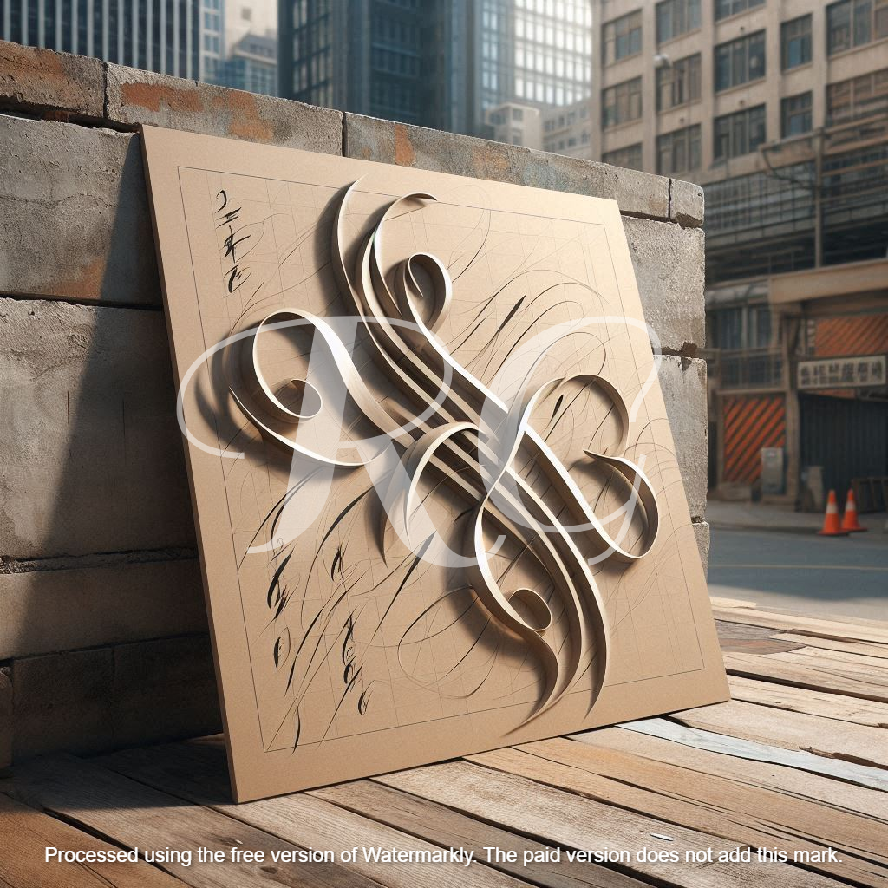

---  
layout: home
title: "Calligraphy Showcase"  
excerpt: "Celebrating the art of beautiful handwriting and its fusion with personal expression."  
comments: true  
share: true  
toc: true  
category: portfolio  
tags: 
- calligraphy
- visual-art
- lettering
- typography  
---  
<link rel="stylesheet" href="/assets/css/calligraphy.css">

## Calligraphy: A Fusion of Tradition and Personal Expression  

Calligraphy, often described as "the art of beautiful handwriting," transcends its functional roots to become a celebration of form, movement, and artistry. Over time, I have developed a unique style that blends classical techniques with modern, street-inspired aesthetics. My work embodies a dialogue between tradition and innovation, utilizing unconventional tools and materials to craft expressive visual stories.  

---

## **Holiday Commissions: Celebrate the Season with Calligraphy**  

The holidays are the perfect time to add a personalized and artistic touch to your celebrations! Whether you're looking to impress with custom gift tags, greeting cards, or bespoke art pieces, I can help bring your ideas to life through calligraphy.  

### **Featured Client Piece**  

#### **"Celebrating Friendship"**  
Commissioned by a University of Texas student, this piece commemorates a cherished friendship. The artwork blends classical elegance with a modern flair to capture the enduring bond between two lifelong friends.  

  

A heartfelt holiday commission celebrating friendship, blending classical and modern calligraphy styles.

---

### **What’s Available for the Holidays**  

- **Personalized Holiday Cards**  
  Add a heartfelt message in elegant lettering, perfect for spreading joy.  
   
- **Custom Gift Tags**  
  Make your gifts stand out with hand-lettered tags that complement your holiday wrapping.  

- **Framed Calligraphy Artwork**  
  A timeless and thoughtful gift for loved ones, featuring quotes or phrases of your choice.  

- **Seasonal Decor Pieces**  
  Commission a unique artwork to elevate your holiday ambiance.  

### **Order Details and Deadlines**  

- **Holiday Commission Deadline**: December 20th  
- To place an order, reach out via [email](mailto:robertgrantham40@gmail.com) or the [contact page](../contact).  

---

### Materials and Process  

My artistic process revolves around repurposing everyday materials into canvases for creativity. **Cardboard**, a raw and textured medium, serves as my primary canvas, lending each piece a tactile, authentic quality. This choice reflects both practicality and a desire to highlight beauty in unexpected places.  

For tools, I combine **traditional calligraphy pens** and markers with bold instruments influenced by street art, such as brushes, thick markers, or found objects. The juxtaposition of fine, controlled lines with spontaneous, rough strokes captures the duality of my work: precise yet organic, structured yet free-flowing.  

---

### Style and Inspirations  

Grounded in the core principles of calligraphy—**balance, rhythm, and harmony**—my work also reflects deeply personal experiences. Each piece tells a story, whether through a classical quote, an original composition, or a word that resonates on an emotional level.  

One of my standout creations reads:  
**"Calligraphy is for the pen what opera is for the voice."**  
This piece encapsulates the grandeur and emotion I strive to infuse into every stroke, where intent and artistry converge to form a powerful visual narrative.  

---

### Featured Works  

#### **1. The Elegance of the Curve**  

This piece emphasizes the grace of curves, inviting viewers to follow the natural flow of its lines.

---  

#### **2. Urban Lettering**  

Inspired by the dynamic energy of city life, this work fuses graffiti with classical calligraphy.

---  

#### **3. Words of Strength**  

Combining sharp and flowing strokes, this piece symbolizes resilience and determination.

---

### How I Approach Each Piece  

Each calligraphy project begins with a single question: **What is the emotional tone I wish to convey?**  
I then explore various layouts, balancing the flow of text with the interplay of positive and negative space. This iterative process ensures that each piece is not only visually compelling but also emotionally resonant.  

My goal is to create art that speaks to the heart. Whether it’s the fluidity of a script or the boldness of a stroke, every element is crafted with intention, enhancing the connection between the viewer and the work.  

---

### Custom Calligraphy Services  

Beyond holiday commissions, I offer year-round **custom calligraphy services** tailored to your needs:  
- Unique artworks for your home,  
- Personalized gifts for special occasions,  
- Custom lettering for events or branding.  

Reach out to discuss your vision, and together we can create something extraordinary.  

For inquiries, please contact me via the [contact page](../contact) or email me at [robertgrantham40@gmail.com](mailto:robertgrantham40@gmail.com).  

---

### Get in Touch  

To explore more of my work or discuss a custom project, feel free to [contact me](../contact) or visit my [portfolio](../portfolio). I am always eager to take on new creative challenges and push the boundaries of this timeless art form.  

---
