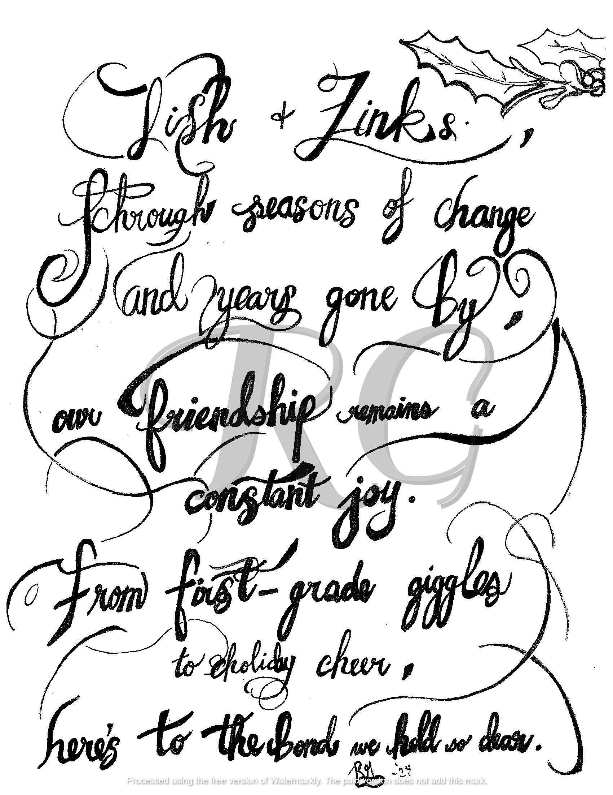
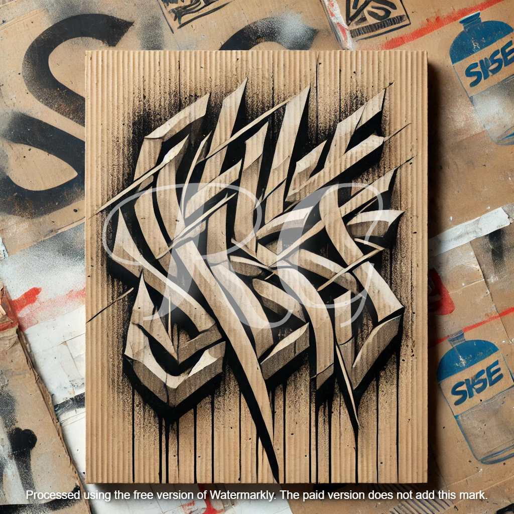
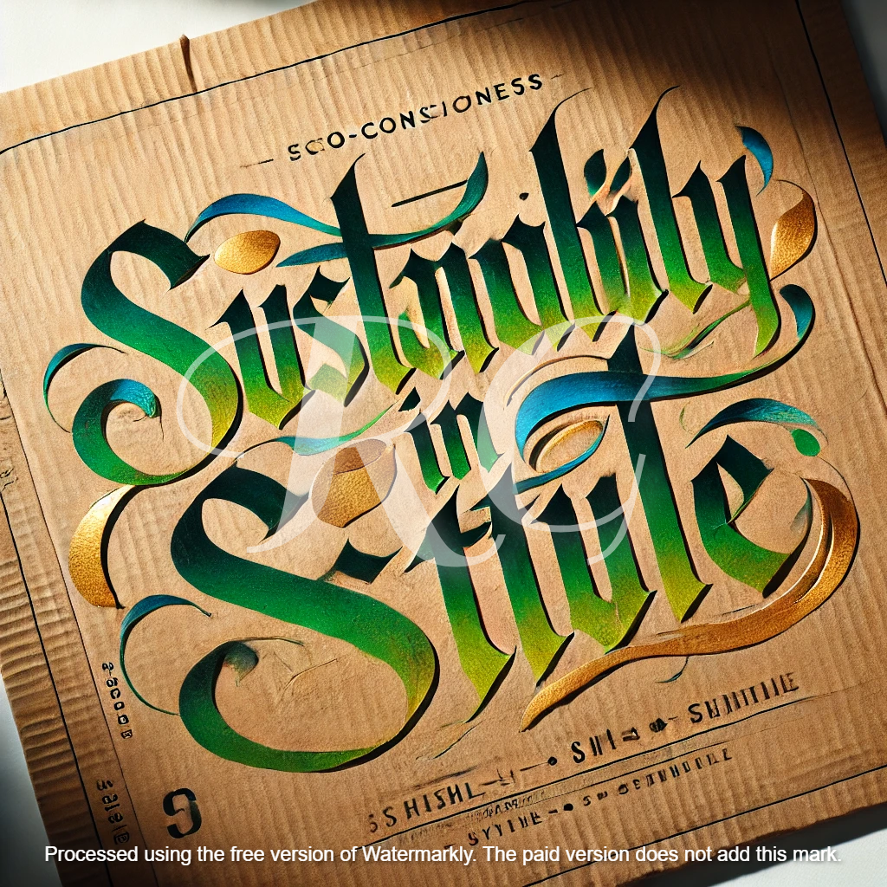

---  
layout: home
author_profile: true
excerpt: "Celebrating the art of beautiful handwriting and its fusion with personal expression."  
comments: true  
share: true  
toc: true  
category: portfolio  
tags:  
  - calligraphy  
  - visual-art  
  - lettering  
  - typography  
---
<link rel="stylesheet" href="/assets/css/gallery.css">

# Calligraphy Gallery

Welcome to my Calligraphy Gallery! Here, you'll find a collection of my work that reflects not only my passion for the art but also my dedication to giving back to the community and the environment. I use **recycled cardboard as my canvas**, blending sustainability with creativity. Each piece is unique, designed with care, and contributes to keeping materials out of landfills.

---

<section class="cardboard-container">
  
  

    
    

      <h3>{{ artwork.title }}</h3>
      
{{ artwork.description }}

      
Eco-Friendly

    

  

  
</section>

---

## Why Cardboard?

Using recycled cardboard is more than just a personal style—it's a philosophy. By reimagining discarded materials, I create art that tells a story of transformation and resilience. Each panel is carefully prepared, its natural texture adding depth and character to my calligraphy. This practice allows me to:

- Reduce waste and contribute to sustainability.
- Offer a unique aesthetic that blends raw authenticity with artistic elegance.
- Honor the community that supports me by giving back in an impactful way.

---

<section class="cta">
  <h2>Commission Your Own Calligraphy Artwork</h2>
  
Interested in having a piece created just for you or someone special? Let's work together to bring your vision to life.

  <a href="/contact/">Get in Touch</a>
</section>

---

## Featured Pieces

Here are a few examples of the types of work I create, from heartfelt personal pieces to striking statements of art:

### Lish & Zinks

*A piece celebrating lifelong friendship, created with intricate flourishes and holiday-inspired details.*

### Urban Calligraphy

*Bold and modern, this piece reflects the vibrancy of urban life with a contemporary calligraphy style.*

### "Sustainability in Style"

*Combining vibrant strokes with raw cardboard edges, this work celebrates the fusion of eco-consciousness and creativity.*

---

## Let's Create Together

I believe that calligraphy can be both art and a statement of values. Every piece I create carries meaning, whether it’s a message of love, a celebration of friendship, or a tribute to nature. Explore my work, and if something speaks to you, reach out—I’d love to collaborate.

Thank you for visiting, and I hope my work inspires you as much as the process inspires me.

---

Thank you for visiting the gallery. Check back often to see new works!
