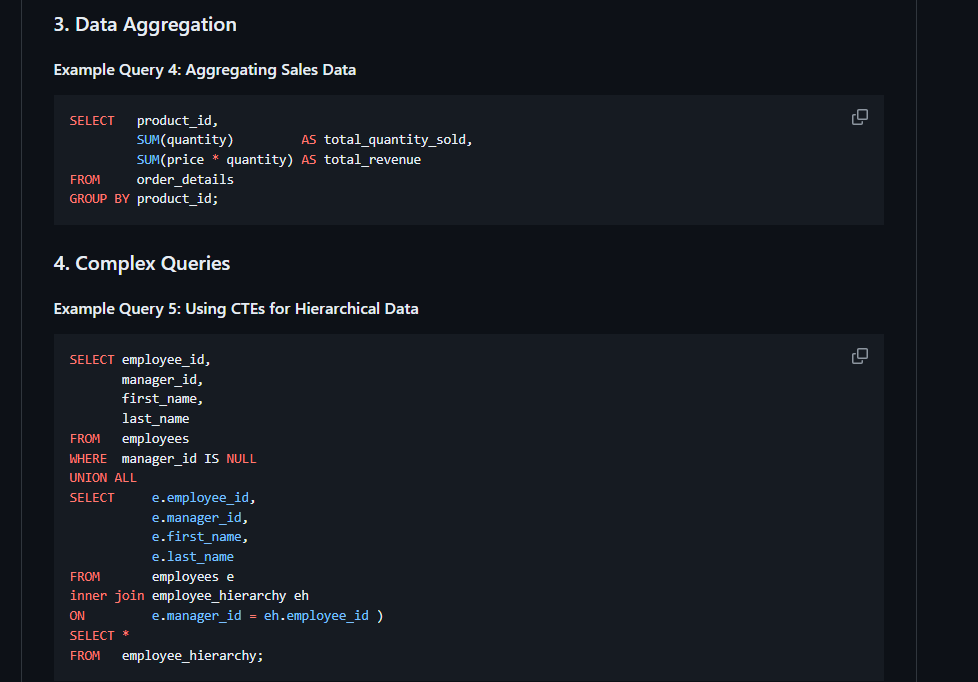
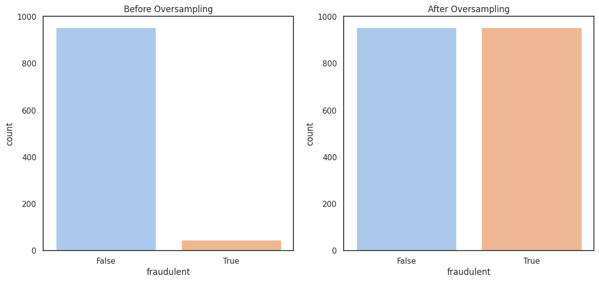
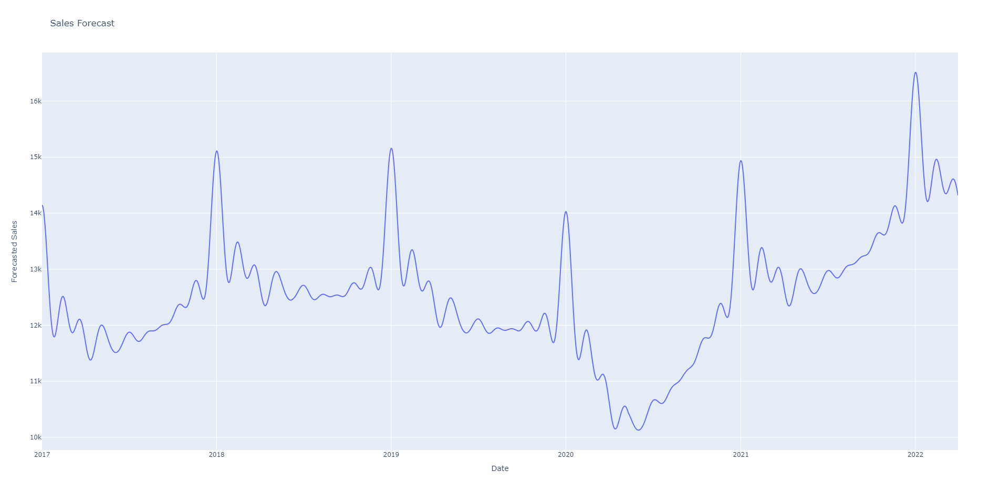
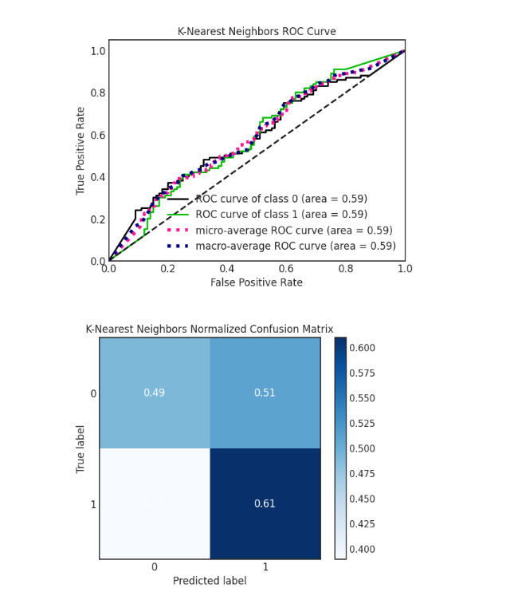
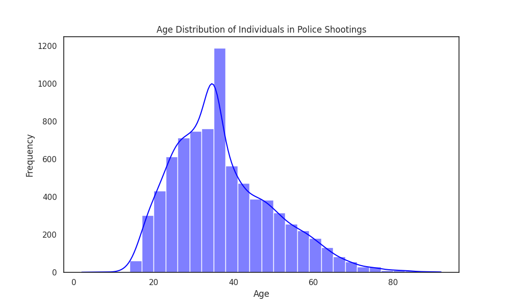

<!-- Google tag (gtag.js) -->

<head>
    <meta charset="UTF-8">
    <meta name="viewport" content="width=device-width, initial-scale=1.0">
    <title>Data Analytics Projects</title>
    <link rel="stylesheet" href="https://stackpath.bootstrapcdn.com/bootstrap/4.5.2/css/bootstrap.min.css">
    
</head>

<body>
    

        <h1 class="my-4">Data Analytics Projects</h1>
        

            <!-- Project 1 -->
            

                

                    
                    

                        <h5 class="card-title">SQL Examples</h5>
                        
Example of SQL queries and solutions.

                        <a href="https://github.com/rgrantham82/SQL_Examples" class="btn btn-primary" data-toggle="tooltip" title="View SQL Examples Project">View Project</a>
                    

                

            

            <!-- Project 2 -->
            

                

                    
                    

                        <h5 class="card-title">Fraud Detection Project</h5>
                        
AI-driven fraud prevention system visualization.

                        <a href="https://github.com/rgrantham82/fraud-detection" class="btn btn-primary" data-toggle="tooltip" title="View Fraud Detection Project">View Project</a>
                    

                

            

            <!-- Project 3 -->
            

                

                    
                    

                        <h5 class="card-title">Forecasting Mini-Course Sales</h5>
                        
Sales prediction analysis for a mini-course.

                        <a href="https://www.kaggle.com/code/robertgrantham/forecasting-mini-course-sales" class="btn btn-primary" data-toggle="tooltip" title="View Sales Forecasting Project">View Project</a>
                    

                

            

            <!-- Project 4 -->
            

                

                    
                    

                        <h5 class="card-title">Predicting Credit Approval</h5>
                        
Predictive model for credit approval assessment.

                        <a href="https://www.kaggle.com/code/robertgrantham/predicting-credit-approval" class="btn btn-primary" data-toggle="tooltip" title="View Credit Approval Project">View Project</a>
                    

                

            

            <!-- Project 5 -->
            

                

                    
                    

                        <h5 class="card-title">Austin Violent Crime Insights Dashboard</h5>
                        
Interactive Crime Data Visualization

                        <a href="https://public.tableau.com/views/AustinViolentCrimeInsightsDashboard/Dashboard1?:language=en-US&:sid=&:display_count=n&:origin=viz_share_link" class="btn btn-primary" data-toggle="tooltip" title="View Austin Crime Dashboard">View Project</a>
                    

                

            

            <!-- Project 6 -->
            

                

                    
                    

                        <h5 class="card-title">Police Shootings Analysis</h5>
                        
In-depth data examination of police shootings.

                        <a href="https://www.kaggle.com/code/robertgrantham/police-shootings-analysis" class="btn btn-primary" data-toggle="tooltip" title="View Police Shootings Analysis Project">View Project</a>
                    

                

            

            <!-- Project 7 -->
            

                

                    
                    

                        <h5 class="card-title">Client Segmentation Project</h5>
                        
Client segmentation based on various attributes such as annual income, investment amount, and engagement score.

                        <a href="/assets/files/client-segmentation.html" class="btn btn-primary" data-toggle="tooltip" title="View Client Segmentation Project">View Project</a>
                    

                

            

        

    

    
    
    
    
</body>
 
